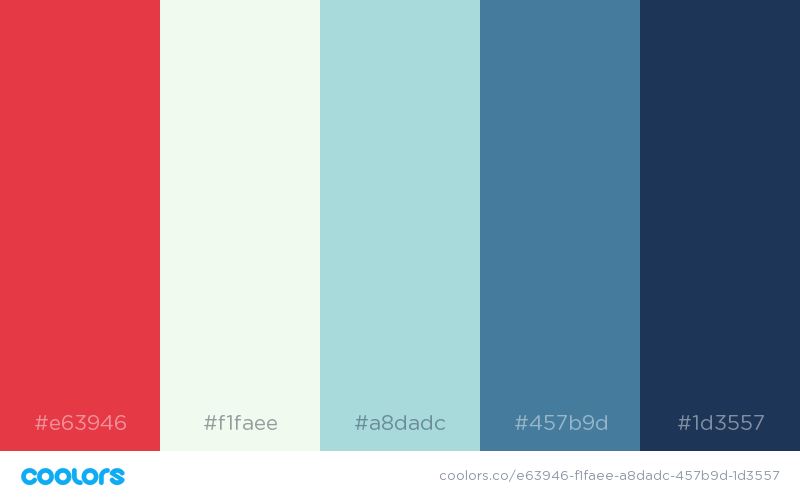

# Opened Me (Defunct)
A simple link opening tracker

~Live here: https://openedme.com~

### What does openedme do?
It sends you an email when someone opens the link you send them.

### Can I anonymize my link?
Yes! We use TinyURL to shortern and anonimize the link


### Email API

This service uses the [Mailjet's API](https://mailjet.com "Mailjet's Homepage")
API to send emails but you can modify the ```send_email.py``` file to send via whichever provider you want.

### Location API

I use [IP Stack's API](https://ipstack.com) to get the location of the people who click the link but you can modify the ```send_email.py``` file to send via whichever provider you want.


### Google Analytics tracking

In order to enable Google analytics tracking please put your tracking ID in the ```GA_TRACKING``` variable in ```config.py``` 

### Potential enhancements

1. Create a database to store URLs and thus make your own URL shortner. - Requires Patreon funding to be ($10/month)
2. Allow users to see via webpage how many opens there have been for the URL via a database. - Requires Patreon funding to be ($10/month)
3. Location tracking (currently limited to 10k clients per month) - Requires Patreon to be ($19/month)

### How do I use it myself?

Just add your domain name where you're running this app and your MailJet credentials to the ```config.py``` file

### How do I support the service?

You can support the service by helping with the server costs by going here:  https://patreon.com/openedme

Please feel free to develop this project more and fix issues as you see them!


### Color scheme


